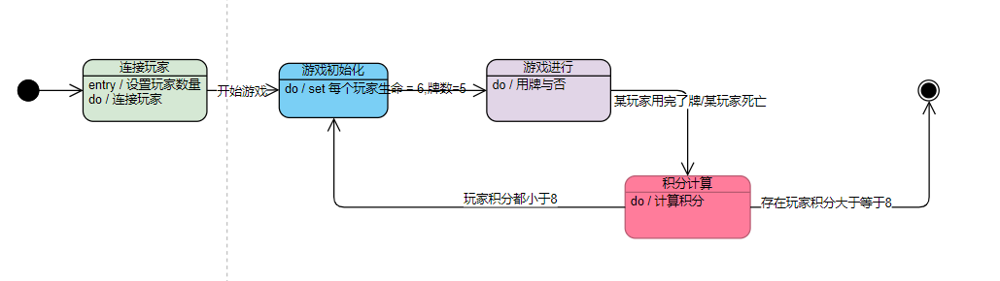

## [游戏背景](https://www.sohu.com/a/311836901_100185646)

“出包”即英文trouble（麻烦、出错）的音译词，那么《出包魔法师》这个游戏的背景大家就大概明白了吧。没错，这就是一个愚蠢魔法师们的大型车祸现场。错误百出的法术施展，让这个游戏充满了欢乐和趣味。尽管如此，每个玩家还是要尽力尝试施展各种法术，争取第一个登上大魔法师之塔的顶峰。


**这是一款适合2-5人的欢乐家庭游戏**，在游戏中，玩家各扮演一名拥有6滴生命的魔法师，通过施展各种法术相互攻击，奋力击败其他魔法师。


## 玩法介绍

建议看看这个玩法介绍视频https://www.bilibili.com/video/av330037198/

谁先八分谁就赢。

- 用完咒语石，得三分。
- 如果有玩家被击杀，
  - 攻击玩家获三分
  - 其余存活玩家获1分
  - 阵亡玩家获0分


一共有36个咒语石，一阶段咒语石有1个，二阶段咒语石有2个，n阶段咒语石有n个。（1<=n<=8）。

每个咒语石的作用如下：

1. 一阶段-古代巨龙：投掷骰子，其余玩家失去相等数量的生命但是如果施放失败。自己也必须投掷骰子失去相等数量的生命。
2. 二阶段-黑暗幽灵：其余玩家失去1点生命，自己回复1点生命，生命上限不超6.
3. 三阶段-甜蜜的梦：投掷骰子，回复相同数量的血，生命上限不超6.
4. 四阶段-猫头鹰：获得一个可以查看、不能使用的、不可公布的秘密咒语石；如果游戏结束且自己存活则积分+1.
5. 五阶段-闪电暴风雨：左、右手边玩家各失去一点生命
6. 六阶段-暴风雪：左手边玩家失去一点生命
7. 七阶段-火球：右手边玩家失去一点生命
8. 八阶段-魔法药水：回复1点生命，生命上限不超6.

显然数字越小越强。


轮流开始，每次只有一个活跃玩家进行选择使用咒语石

1.施放失败
生命值-1
强制结束回合
2.施放成功
发动效果
选择是否继续释放（数字必须大于等于原来咒语）


### 人数说明

一般是2~5人，人数少会翻开咒语石作为公牌。

2人，额外翻开12个咒语石。

3人，额外翻开6个咒语石。


## 开启游戏

### 编译

```
git clone https://github.com/JaxChan25/abracada_what_game.git
cd abracada_what_game
gcc chat_server.c -D_REENTRANT -o server -lpthread
gcc chat_clnt.c -D_REENTRANT -o cilent -lpthread
```

也可以下载relaese


### 运行

启动服务：`./cserv port`

玩家加入：`./cilent {server_ip} {server_port} {your_name}`


## 技术说明

### 状态机

一共5个状态：

初始、连接玩家、游戏初始化，游戏进行、积分计算、结束




### 技术栈

技术比较简单，服务端使用多线程+socket（tcp协议）完成的。

纯c实现。

